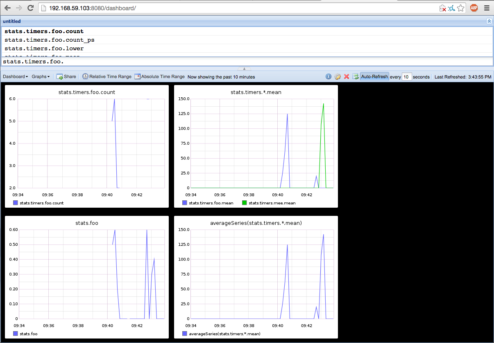

# Docker Image for Graphite

## Deploy Graphite & Statsd with a single command

Graphite & Statsd are difficult to orchestrate.
This Docker image will help you get up & running quickly.

Follow this * tutorial *, and you will end up with a similar setup:



## Quick Start

```sh
docker run -d --name graphite -p 8080:80 -p 2003:2003 -p 8125:8125/udp castawaylabs/graphite-statsd
```

This starts a Docker container named: **graphite**

### Includes the following components

* [Nginx](http://nginx.org/) - reverse proxies the graphite dashboard
* [Graphite](http://graphite.readthedocs.org/en/latest/) - front-end dashboard
* [Carbon](http://graphite.readthedocs.org/en/latest/carbon-daemons.html) - back-end
* [Statsd](https://github.com/etsy/statsd/wiki) - UDP metrics aggregator

### Mapped Ports

| Service | Host | Container |
| ------- | ---- | --------- |
| nginx   |   80 |        80 |
| carbon  | 2003 |      2003 |
| statsd  | 8125 |      8125 |

### Mounted Volumes

These volumes can be optionally mounted. For whatever reason, if you want to edit the config files, i suggest you fork this repo and edit conf/*.conf directly, rebuilding the image as you wish.

Alternatively, you can mount files to overwrite the defaults.. See the `Dockerfile` for more info (look for ADD statements)

| Container             |
| --------------------- |
| /var/log              |
| /opt/graphite/storage |
| /opt/graphite/conf    |

## Start Using Graphite & Statsd

### Send Some Stats

Let's fake some stats with a random counter to prove things are working.

```sh
echo "foo:1|c" | nc -u -w0 127.0.0.1 8125
echo "foo:25|ms" | nc -u -w0 127.0.0.1 8125
```

### Visualize the Data

Open Graphite in a browser at [http://localhost/dashboard](http://localhost/dashboard).

In ~10s, refresh graphite, you should see `stats.foo` and `stats.timers.foo.*`.

## Update the Configuration

1. Update the default Django admin user account. _The default is insecure._

  * username: root
  * password: root
  * email: root.graphite@example.com

  First login at: [http://localhost/account/login](http://localhost/account/login)
  Then update the root user's profile at: [http://localhost/admin/auth/user/1/](http://localhost/admin/auth/user/1/)

2. Read up on Graphite's [post-install tasks](https://graphite.readthedocs.org/en/latest/install.html#post-install-tasks).
  Focus on the [storage-schemas.conf](https://graphite.readthedocs.org/en/latest/config-carbon.html#storage-schemas-conf)

  **Note:** Fork this repo and rebuild the image, changing conf/*.conf files. These are defaults and will work for most configurations, but if you need something specific, check out the docs link above.

  [Read more about synching Statsd with Graphite configs.](https://github.com/etsy/statsd/blob/master/docs/graphite.md)

3. Learn about [Statsd](https://github.com/etsy/statsd/).

4. Start sending stats from your apps.


## Additional Reading

* [Introduction to Docker](http://docs.docker.io/#introduction)
* [Practical Guide to StatsD/Graphite Monitoring](http://matt.aimonetti.net/posts/2013/06/26/practical-guide-to-graphite-monitoring/)
* [Configuring Graphite for StatsD](https://github.com/etsy/statsd/blob/master/docs/graphite.md)

# Contributors

- Matej Kramny <matej@matej.me>

Sponsored by [nodegear](https://nodegear.com) - Awesome Nodejs Platform for Developers (with real-time stats)

Work inspired by this awesome guy: [hopsoft](https://github.com/hopsoft) from [his repo](https://github.com/hopsoft/docker-graphite-statsd) _(i cleaned it up a little ~a lot~)_

# License

[WTFPL](http://www.wtfpl.net/)